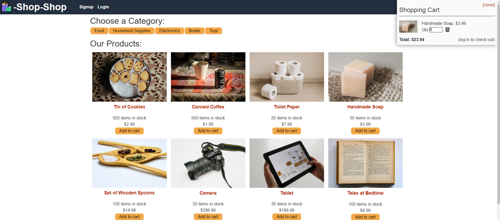

# <Week 22: State Homework: Redux Store>  
  
    

  ## Description  
  ### What was your motivation?  
    - Refactor an existing webapp to use Redux, to take full advantage of global state for easy access in all components and pages.  
  ### Why did you build this project?  
    - As a basic introduction to Redux, to understand why it is used and the practical applications.  
  ### What problem does it solve?  
    - Redux allows data to be stored seperately from the app flow to allow data to be accessed regardless of where the component is.  State flows in one direction generally, so being able to access it from anywhere is key.  
  ### What did you learn making this project?  
    - I learned an introduction to Redux, as well as Stripe and a better understanding of React.  
   
  ## Table of Contents 
  - [Installation](#installation)  
  - [Usage](#usage)  
  - [Credits](#credits)  
  - [License](#license)  

  ## Installation  
  ### The application will be invoked by using the following command:  
      visit the deployed website: 
      <https://shrouded-journey-51629.herokuapp.com/>  

  ## Usage  
    
      
  ## Credits  
  Contact me at: [email](poo328@my.utsa.edu "email")  
  Github can be found at: [Github](https://github.com/MrG105 "Github")  
    
  ## License
      Licensed under the MIT license  
  ---
